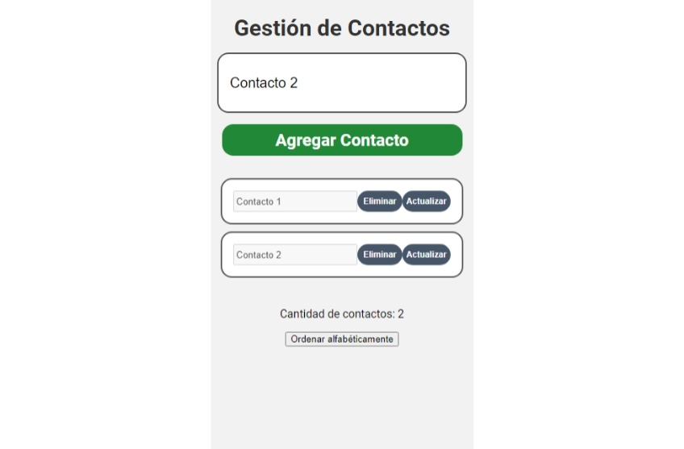

# Make It Real - Gestión de Contactos

This is a solution to the Gestión de Contactos project of the Make It Real course.

## Table of contents

- [Overview](#overview)
  - [The challenge](#the-challenge)
  - [Screenshot](#screenshot)
- [My process](#my-process)
  - [Built with](#built-with)
  - [What I learned](#what-i-learned)
  - [Continued development](#continued-development)
  - [Useful resources](#useful-resources)
- [Author](#author)
- [Acknowledgments](#acknowledgments)

## Overview

### The challenge

Users should be able to:

- Add, update, and delete contacts.
- View a real-time counter of the total number of contacts.
- Sort contacts alphabetically.
- Persist contact data using `localStorage`, so contacts are saved even after refreshing the page.

### Screenshot



Add a screenshot of your solution. The easiest way to do this is to use Firefox to view your project, right-click the page, and select "Take a Screenshot". You can choose either a full-height screenshot or a cropped one based on how long the page is. If it's very long, it might be best to crop it.

Alternatively, you can use a tool like [FireShot](https://getfireshot.com/) to take the screenshot. FireShot has a free option, so you don't need to purchase it.

Then crop/optimize/edit your image however you like, add it to your project, and update the file path in the image above.

## My process

### Built with

- Semantic HTML5 markup
- CSS custom properties
- Flexbox
- Mobile-first workflow
- Vanilla JavaScript for DOM manipulation and event handling
- `localStorage` for data persistence

### What I learned

While working on this project, I reinforced my understanding of:

- Manipulating the DOM dynamically with JavaScript to create, update, and delete elements.
- Using `localStorage` to persist data across sessions, allowing users to maintain their contact list even after refreshing the browser.
- Implementing basic array operations in JavaScript, such as adding, removing, and searching for elements.
- Creating user-friendly interfaces with feedback, such as alerts when trying to add duplicate contacts or empty values.

Example of using `localStorage`:

```javascript
function guardarContactos() {
  localStorage.setItem("contactos", JSON.stringify(contactos));
}
```

### Continued development

In future projects, I plan to focus on:

- Improving form validation and user feedback mechanisms.
- Implementing more advanced features like search functionality and contact grouping.
- Exploring frameworks like React to manage state and UI in more complex applications.

### Useful resources

- [MDN Web Docs - localStorage](https://developer.mozilla.org/en-US/docs/Web/API/Window/localStorage) - This documentation was crucial for understanding how to use `localStorage` effectively.
- [JavaScript Array Methods](https://www.w3schools.com/js/js_array_methods.asp) - A great resource for learning more about manipulating arrays in JavaScript.

## Author

- GitHub - [JaquelineRocio](https://github.com/JaquelineRocio)

## Acknowledgments

I would like to thank the instructors at Make It Real for their guidance throughout this project. Special thanks to the online community for their helpful resources and tutorials.
